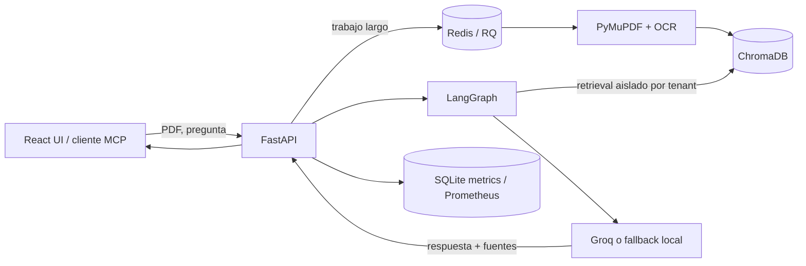

# AI Research Assistant

**Convierte colecciones de PDF en una base de conocimiento consultable, con respuestas
trazables hasta el archivo y la página que las sustentan.** El producto combina una interfaz
React, una API FastAPI y un pipeline RAG que puede ejecutarse sin servicios de IA de pago o
usar un LLM externo cuando se configura una clave.

> Estado: aplicación ejecutable localmente y preparada para despliegue mediante imágenes
> inmutables. Este repositorio no afirma mantener una demo pública activa; el pipeline queda
> listo para conectarse a un host mediante secretos de GitHub Environment.

## Por qué no es otro «chat con PDF»

- **Evidencia verificable:** muestra fragmentos, archivo, página y distancia de retrieval.
- **Flujo auditable:** LangGraph separa coordinación, búsqueda, crítica, respuesta y citas.
- **Ingesta robusta:** extracción de texto, fallback OCR y trabajos Redis/RQ para procesos largos.
- **Calidad medible:** benchmark versionado, métricas IR, pruebas adversariales y quality gate.
- **Aislamiento:** la API key determina el tenant y cada búsqueda filtra su `owner_id`.
- **Operable:** trazas, métricas Prometheus, dashboard Grafana, alertas, backups y rollback.

## Demo rápida

```bash
docker compose up --build
./scripts/demo.sh Guia.pdf "¿Cuál es la idea principal del documento?"
```

Abre la aplicación en `http://localhost:8080` y la documentación OpenAPI en
`http://localhost:8000/docs`. Para una presentación sin Docker, consulta las instrucciones de
[ejecución local](#ejecutar-localmente) y el [flujo de entrevista](#flujo-de-demo-para-entrevista).

## Arquitectura del producto



## Capacidades de producción

- **Entrega:** CI valida backend y frontend; el deploy publica imágenes GHCR por SHA y revierte
  automáticamente si falla el health check.
- **Procesamiento:** Redis + RQ desacoplan OCR e indexación mediante `POST /jobs/upload-pdf`.
- **Observabilidad:** correlación por `X-Trace-ID`, métricas de latencia/tokens/coste, Prometheus,
  Grafana y reglas de alerta.
- **Continuidad:** backups con checksum y retención, restauración ensayable y decisiones en ADR.

Consulta el [runbook de operaciones](docs/operations.md) y los [ADR](docs/adr/) antes de
configurar un entorno remoto.

## Stack

- **Backend:** FastAPI, PyMuPDF, ChromaDB, scikit-learn, Sentence Transformers y Groq opcional.
- **Frontend:** React, TypeScript y Vite.
- **Agentes e integración:** LangGraph y servidor MCP por stdio.
- **Plataforma:** Redis, RQ, Docker Compose, Prometheus, Grafana y GitHub Actions.

## Estructura

```text
ai-research-assistant/
├── backend/
│   ├── app/           # API, RAG, agente, seguridad y observabilidad
│   ├── evaluation/    # dataset y resultados reproducibles
│   └── tests/         # integración, seguridad, retrieval y unidades
├── frontend/
│   └── src/           # componentes, hooks, cliente y tipos
└── docker-compose.yml
```

## Agente de investigación

El proyecto ya incluye una capa agentica sobre el RAG clasico. El agente no solo llama al LLM: ejecuta un flujo controlado con pasos visibles para demo tecnica:

1. **Piensa:** normaliza la pregunta y revisa la memoria reciente de la sesion.
2. **Decide:** determina si necesita buscar evidencia documental o si es solo un saludo.
3. **Usa herramientas:** llama a `search_similar_chunks` para recuperar chunks desde ChromaDB.
4. **Toma decisiones:** marca si encontro contexto suficiente y si debe citar fuentes o pedir mas documentos.
5. **Responde:** usa `generate_rag_answer` con Groq cuando `GROQ_API_KEY` existe, o fallback local si trabajas offline.

Endpoint principal:

```bash
curl -X POST http://localhost:8000/agent/chat \
  -H "Content-Type: application/json" \
  -d '{"question":"Cual es la idea principal del paper?","session_id":"demo","limit":4}'
```

La respuesta incluye `agent_steps`, `agent_framework`, `sources`, `history`, `estimated_prompt_tokens` e `included_contexts`. En el frontend puedes alternar entre **Agente IA** y **RAG clasico**.

### Frameworks de agentes

- **LangGraph:** es el framework recomendado para evolucionar este proyecto porque su modelo de nodos/estado encaja con el flujo implementado en `app/agent.py`. La versión actual implementa los pasos como nodos de un `StateGraph` compilado y mantiene las herramientas inyectables para facilitar las pruebas.
- **CrewAI:** util si mas adelante quieres varios roles, por ejemplo investigador, critico y redactor.
- **AutoGen:** util si quieres conversaciones multiagente al estilo Microsoft, con agentes que se revisan entre si.

Para una entrevista, recorre cada nodo y explica por qué el routing explícito resulta más auditable que un bucle de herramientas abierto.

## MCP (Model Context Protocol)

El backend tambien expone un servidor MCP por stdio para conectar el asistente
con clientes compatibles con Model Context Protocol. Esto permite reutilizar la
misma base RAG desde herramientas externas sin pasar por el frontend.

Herramientas MCP incluidas:

- `list_documents`: lista PDFs indexados en ChromaDB.
- `search_pdf_knowledge_base`: busca fragmentos relevantes por similitud semantica.
- `ask_research_assistant`: responde con el flujo RAG clasico y devuelve fuentes.
- `ask_research_agent`: responde con el flujo agentico y sus pasos visibles.

Ejecutar el servidor MCP:

```bash
cd ai-research-assistant/backend
python -m app.mcp_server
```

Configuracion ejemplo para un cliente MCP local:

```json
{
  "mcpServers": {
    "ai-research-assistant": {
      "command": "python",
      "args": ["-m", "app.mcp_server"],
      "cwd": "/ruta/a/AIResearchAssistantProject/ai-research-assistant/backend"
    }
  }
}
```

## Arquitectura RAG

```text
PDF
↓
Extracción de texto
↓
Chunks con solapamiento
↓
Embeddings configurables
↓
ChromaDB como base vectorial
↓
Búsqueda semántica de fragmentos relevantes
↓
LLM con Groq/Llama o fallback local
↓
Respuesta en español con fuentes y memoria de sesión
```

El flujo no depende de búsqueda exacta por palabras: cada chunk del PDF y cada pregunta se transforman en vectores para recuperar los fragmentos más cercanos antes de generar la respuesta. Por defecto el proyecto usa `HashingVectorizer` para funcionar offline; si configuras `EMBEDDING_PROVIDER=sentence-transformers`, usa un modelo local de Sentence Transformers para mejorar la recuperación semántica. Si cambias de proveedor de embeddings, usa una colección o carpeta `CHROMA_DIR` nueva para evitar mezclar vectores de distinta dimensión.

### Componentes y secuencia

```text
Navegador/CLI
     │ PDF y preguntas
     ▼
React ───────────────► FastAPI
                         ├── PyMuPDF/OCR ──► chunks
                         ├── embeddings ───► ChromaDB
                         ├── LangGraph ────► búsqueda + crítica + respuesta
                         └── historial/observabilidad local
```

En una consulta, FastAPI valida la entrada, recupera el historial de la sesión,
busca los fragmentos más relevantes y entrega al generador solo el contexto que
cabe en el presupuesto configurado. La respuesta conserva las fuentes y páginas
recuperadas para que el usuario pueda verificarla. Los intentos básicos de prompt
injection se rechazan antes de ejecutar la búsqueda o el agente.

## Casos de uso

- Papers académicos y documentación técnica.
- Contratos o políticas internas en PDF con texto seleccionable.
- Facturas, manuales o procedimientos que necesiten consulta conversacional.
- Bases de conocimiento pequeñas donde se requiere citar fuentes por archivo y página.

## Ejecutar localmente

### Backend

```bash
cd ai-research-assistant/backend
python -m venv .venv
source .venv/bin/activate
python -m pip install -r requirements-dev.txt
cp .env.example .env
uvicorn app.main:app --reload
```

La API queda disponible en `http://localhost:8000` y la documentación en `http://localhost:8000/docs`.

### Frontend

```bash
cd ai-research-assistant/frontend
npm install
cp .env.example .env
npm run dev
```

La app queda disponible en `http://localhost:5173`.

## Ejecutar con Docker

```bash
docker compose up --build
```

- Frontend: `http://localhost:8080`
- Backend: `http://localhost:8000`

## Variables de entorno principales

| Variable | Uso |
| --- | --- |
| `GROQ_API_KEY` | Activa respuestas generativas con Groq. Si no está configurada, se usa fallback local basado en fuentes recuperadas. |
| `GROQ_MODEL` | Modelo Groq, por defecto `llama-3.1-8b-instant`. |
| `LLM_TEMPERATURE` | Controla creatividad/variación de respuestas; por defecto `0.2`. |
| `LLM_TOP_P` | Controla muestreo nucleus; por defecto `0.9`. |
| `MAX_CONTEXT_TOKENS` | Presupuesto aproximado de tokens para historial + contexto RAG; por defecto `6000`. |
| `EMBEDDING_PROVIDER` | `hashing` para modo local rápido o `sentence-transformers` para recuperación semántica mejorada. |
| `SENTENCE_TRANSFORMER_MODEL` | Modelo local para embeddings semánticos cuando `EMBEDDING_PROVIDER=sentence-transformers`. |
| `HASHING_EMBEDDING_FEATURES` | Dimensión del vectorizador hashing local; por defecto `384`. |
| `CHROMA_DIR` | Carpeta de persistencia de ChromaDB. |
| `HISTORY_DIR` | Carpeta de historial conversacional. |
| `UPLOAD_DIR` | Carpeta de PDFs subidos. |
| `ALLOWED_ORIGINS` | Orígenes CORS permitidos para el frontend. |
| `VITE_API_BASE_URL` | URL del backend usada por React. |
| `AUTH_REQUIRED` | Obliga a enviar `X-API-Key`; debe ser `true` fuera de desarrollo local. |
| `API_KEY_TENANTS` | JSON que asigna cada API key a un tenant. El tenant se aplica al indexar, buscar y guardar sesiones. |

## Evaluación de retrieval

El dataset versionado en `backend/evaluation/retrieval_dataset.jsonl` contiene preguntas,
texto de corpus y el documento relevante esperado. El runner compara embeddings hashing/TF-IDF,
dos tamaños de chunk y reranking, y calcula Hit Rate, Precision, Recall, MRR y nDCG en `k`:

```bash
cd ai-research-assistant/backend
python -m app.retrieval_evaluation \
  --dataset evaluation/retrieval_dataset.jsonl \
  --output evaluation/results.json --k 3
```

El formato JSONL permite ampliar el benchmark con ejemplos revisados por humanos sin mezclarlo
con datos privados. Para una comparación semántica de producción, configura además
`sentence-transformers` en un entorno con el modelo descargado y registra la versión del modelo.

### Baseline reproducible

Resultados medidos sobre las **54 consultas** versionadas, con `k=3` (archivo completo en
`evaluation/results.json`):

| Configuración | Hit Rate@3 | MRR@3 | nDCG@3 |
| --- | ---: | ---: | ---: |
| Hashing, sin reranking | 0.6296 | 0.5123 | 0.5423 |
| Hashing, con reranking | 0.6667 | 0.6049 | 0.6208 |
| TF-IDF | **0.7593** | **0.6975** | **0.7134** |

Los tamaños de chunk 40/80 dieron el mismo resultado porque cada caso actual cabe en un único
chunk. El quality gate usa Hit Rate ≥ 0.60 y MRR ≥ 0.50: evita regresiones sobre este baseline,
pero no convierte el corpus sintético en una afirmación de calidad de producción.

## Staging, autenticación y trazas

1. Copia `.env.staging.example` a un archivo de secretos no versionado y cambia la API key,
   dominio y proveedor del modelo.
2. Ejecuta `docker compose -f docker-compose.yml -f docker-compose.staging.yml up -d --build`.
3. Verifica `/health`; los endpoints de documentos, chat, métricas y trazas usan `X-API-Key`.

La API deriva el tenant de la clave (no de datos enviados por el cliente), almacena `owner_id`
en cada chunk y lo añade obligatoriamente al filtro de retrieval. Cada respuesta incluye
`X-Trace-ID`; también se acepta `X-Request-ID` para correlación. Consulta los eventos de una
petición mediante `GET /traces/{trace_id}`. No expongas `/metrics` o `/traces` sin autenticación.

## Flujo de demo para entrevista

1. Ejecuta backend y frontend.
2. Sube un PDF con texto seleccionable.
3. Confirma páginas, caracteres y chunks indexados.
4. Haz una pregunta sobre el documento.
5. Abre las fuentes recuperadas para demostrar grounding, página y distancia de similitud.
6. Haz una pregunta de seguimiento para mostrar memoria de sesión.
7. Explica que el backend aplica un presupuesto de contexto con `MAX_CONTEXT_TOKENS`.
8. Reinicia historial desde la UI si quieres comenzar otra conversación.

### Demo reproducible por terminal

Con los contenedores en ejecución, el script comprueba la API, sube un PDF,
recupera su `document_id` y realiza una consulta restringida a ese documento:

```bash
./scripts/demo.sh Guia.pdf "Cual es la idea principal del documento?"
```

Puedes usar otro backend mediante `API_URL=https://mi-api.example.com`. El script
solo necesita Bash, `curl` y Python 3. No expongas documentos privados en una demo
pública; los archivos, vectores e historiales persisten en los volúmenes locales.

## Pruebas

Las dependencias de ejecución están fijadas en `requirements.txt`; las herramientas
de desarrollo y pruebas están separadas en `requirements-dev.txt`. `pyproject.toml`
centraliza pytest, cobertura mínima del 75 %, Ruff y mypy.

```bash
cd ai-research-assistant/backend
pytest
ruff check .
ruff format --check .
mypy
```

```bash
cd ai-research-assistant/frontend
npm run build
```

GitHub Actions ejecuta estas comprobaciones en cada push y pull request y publica
`coverage.xml` como artefacto. Las pruebas incluyen rutas felices, fallos del LLM,
validación de archivos, límites de carga, CORS, memoria, filtros por documento,
guardrails y rechazo de prompt injection.

## Limitaciones conocidas

- La evaluación RAG local usa métricas heurísticas; no sustituye un dataset de
  evaluación etiquetado ni una revisión humana.
- La detección de PII y prompt injection se basa en patrones y debe complementarse
  con controles adicionales antes de procesar información sensible.
- ChromaDB, el historial y las métricas se almacenan localmente; una instalación
  con múltiples réplicas necesita servicios compartidos y aislamiento por usuario.
- El OCR depende de que Tesseract y sus idiomas estén instalados en el sistema.
- El streaming actual entrega una respuesta ya generada palabra por palabra; no es
  streaming nativo del proveedor LLM.

## Deploy sugerido

Para una demo pública rápida:

- **Backend:** Render, Railway o Fly.io usando `backend/Dockerfile`.
- **Frontend:** Vercel/Netlify o el `frontend/Dockerfile` en cualquier host con contenedores.
- Configura `VITE_API_BASE_URL` con la URL pública del backend.
- Configura `ALLOWED_ORIGINS` con el dominio público del frontend.
- Usa volúmenes persistentes para `CHROMA_DIR`, `HISTORY_DIR` y `UPLOAD_DIR`.

## Trade-offs y límites de diseño

| Decisión | Beneficio | Coste / evolución prevista |
| --- | --- | --- |
| `HashingVectorizer` por defecto | Arranque offline, determinista y sin descargar modelos | Menor calidad semántica; usar Sentence Transformers y versionar la colección para producción |
| ChromaDB e historial locales | Demo simple y datos persistentes con Docker | Varias réplicas requieren vector store y base transaccional compartidos |
| API keys por tenant | Aislamiento pequeño, fácil de demostrar y probar | Sustituir por OIDC/OAuth, roles, cuotas y rotación administrada |
| Redis + RQ | Separa OCR/indexación del request y mantiene una operación sencilla | Añadir política explícita de reintentos, idempotencia y dead-letter queue |
| Evaluación determinista local | Quality gate rápido y reproducible en cada PR | El corpus sintético no reemplaza evaluación humana con documentos reales |
| Streaming por SSE | Interfaz progresiva y protocolo sencillo | Actualmente segmenta una respuesta completa; integrar streaming nativo del proveedor |

La arquitectura prioriza que un reclutador pueda ejecutar y auditar el sistema localmente. Un
servicio con tráfico real debería añadir object storage, eliminación completa por tenant,
rate-limiting, secretos administrados, telemetría distribuida y pruebas periódicas de restauración.
